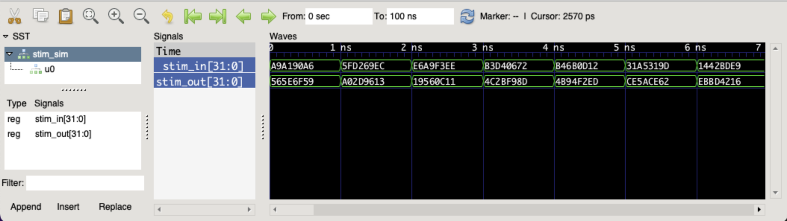

<!--
Copyright © Telecom Paris
Copyright © Renaud Pacalet (renaud.pacalet@telecom-paris.fr)

This file must be used under the terms of the CeCILL. This source
file is licensed as described in the file COPYING, which you should
have received as part of this distribution. The terms are also
available at:
https://cecill.info/licences/Licence_CeCILL_V2.1-en.html
-->

How to use text files to drive simulations?

---

It is sometimes convenient to generate the input stimulus and the expected outputs with a non-VHDL software reference implementation (e.g., a bash, python, C… application).
One way to connect such a software reference implementation with the VHDL simulation is through text files.
In the following example we simulate and verify a toy design that receives 32-bits words and outputs their bit-wise negation:

```vhdl
-- stim.vhd
library ieee;
use ieee.std_logic_1164.all;

entity stim is
    port(
        stim_in:   in  std_ulogic_vector(31 downto 0);
        stim_out:  out std_ulogic_vector(31 downto 0)
    );
end entity stim;

architecture rtl of stim is
begin
    stim_out  <= not stim_in;
end architecture rtl;
```

Of course with such a simple design it would be easy to randomly generate the inputs and compute the expected outputs in VHDL, but in order to demonstrate the use of a stimulus text file we will instead use a small bash script, `stim`:

```bash
#!/usr/bin/env bash

rand() {
    hexdump -vn4 -e'"%08X"' /dev/urandom
}

for (( i = 1; i <= 100; i++ )); do
    n=0x$(rand)
    (( r = n ^ 0xFFFFFFFF ))
    printf "%08X %08X\n" "$n" "$r"
done
```

```bash
./stim > stim.txt
cat stim.txt
```

```escape
<!A9A190A6 565E6F59
5FD269EC A02D9613
E6A9F3EE 19560C11
...!>
```

The generated `stim.txt` text file contains one test vector per line, each composed of the 32-bits input and expected 32-bits output in hexadecimal.
The simulation environment uses the `std.textio` package to read the text file.
Here is what this simulation environment could look like:

```vhdl
-- stim_sim.vhd
use std.textio.all; -- for the text file I/O (readline, read...)

library ieee;
use ieee.std_logic_1164.all;

entity stim_sim is
end entity stim_sim;

architecture sim of stim_sim is

    -- input-output signals of design
    signal stim_in, stim_out: std_ulogic_vector(31 downto 0);

begin

    -- instantiation of design to simulate
    u0: entity work.stim(rtl)
    port map(
        stim_in   => stim_in,  -- 32-bits input
        stim_out  => stim_out  -- 32-bits output
    );

    -- input stimulus and output checking process
    process
        variable l: line; -- type line is declared in std.textio
        file f: text;     -- file type text is declared in std.textio
        variable vin:  std_ulogic_vector(31 downto 0); -- temporary variable to read inputs
        variable vout: std_ulogic_vector(31 downto 0); -- temporary variable to read outputs
    begin
        file_open(f, "stim.txt", read_mode); -- open text file stim.txt in read mode
        while not endfile(f) loop -- while not end of file (for all test vectors)
            readline(f, l);       -- read line
            hread(l, vin);  -- read 32-bits input in hex format
            hread(l, vout); -- read 32-bits expected output in hex format
            stim_in <= vin; -- set 32-bits input
            wait for 1 ns;  -- let output propagate
            assert stim_out = vout -- check output
                report "ERROR: EXPECTED " & to_hstring(vout) & " GOT " & to_hstring(stim_out)
                severity failure;
        end loop;
        wait; -- end of simulation
    end process;

end architecture sim;
```

And then, to simulate with, e.g., `ghdl`:

```bash
ghdl -a --std=08 stim.vhd stim_sim.vhd
ghdl -r --std=08 stim_sim --vcd=stim_sim.vcd
open stim_sim.vcd
```



In this example we use only `hread` to read `std_ulogic_vector` in hex format but many other procedures exist (`read`, `oread`, `bread`…) for various data types.
See the declaration of the [`std.textio`](/doc/data/textio.vhd) package for the list of all text input/output procedures and functions for the VHDL base types.
For `std_ulogic`-based types see the declarations of the [`ieee.std_logic_1164`](/doc/data/std_logic_1164.vhd) and [`ieee.numeric_std`](/doc/data/numeric_std.vhd) packages.

<!-- vim: set tabstop=4 softtabstop=4 shiftwidth=4 expandtab textwidth=0: -->
