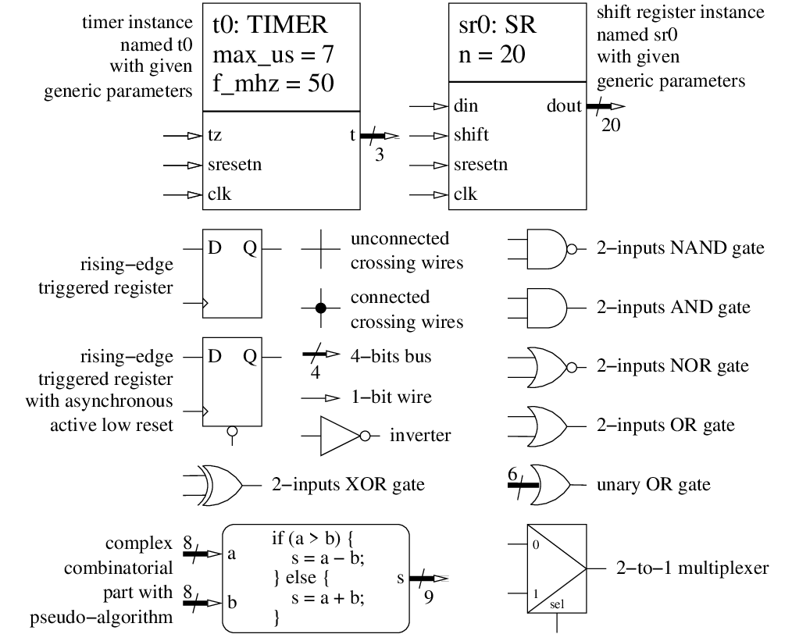

<!--
MASTER-ONLY: DO NOT MODIFY THIS FILE

Copyright © Telecom Paris
Copyright © Renaud Pacalet (renaud.pacalet@telecom-paris.fr)

This file must be used under the terms of the CeCILL. This source
file is licensed as described in the file COPYING, which you should
have received as part of this distribution. The terms are also
available at:
https://cecill.info/licences/Licence_CeCILL_V2.1-en.html
-->

Lab: an edge counter

---

[TOC]

---

# Learn a bit more of the VHDL language

- Integer/vector type conversions ([Arithmetic: which types to use?] part of the documentation)

# CODING CHALLENGE: an edge counter (45 minutes)

In this challenge we will assemble our shift register, resynchronizer/edge detector and our counter, plus custom processes, to create an edge counter.

## Specifications

The entity of the edge counter is named `ec` and its architecture is named `rtl`.
The edge counter has the following input-output ports:

| Name       | Type                            | Direction | Description                                                              |
| :----      | :----                           | :----     | :----                                                                    |
| `clk`      | `std_ulogic`                    | in        | master clock, the design is synchronized on the rising edge of `clk`     |
| `areset`   | `std_ulogic`                    | in        | **asynchronous**, active **high** reset, wired to right user push-button |
| `btn`      | `std_ulogic`                    | in        | **asynchronous**, active **high** reset, wired to left user push-button  |
| `led`      | `std_ulogic_vector(3 downto 0)` | out       | wired to the 4 user LEDs                                                 |

* The design is synchronized on the rising edge of `clk`.
* There is a 2-bits [shift register](../lab02/) used to resynchronize an inverted version of `areset`, named `sresetn`.
* `sresetn` is used as a **synchronous**, active **low** reset for all synchronous parts, except the 2-bits shift register used as re-synchronizer, of course.
* There is a [resynchronizer/edge detector](../lab05/) used to resynchronize the left user push-button and detect its rising and falling edges.
* There is a [counter](../lab06/) with maximum value `cmax` equal to 15, and which current value is sent to `led` (after proper type conversion).
* When an edge of `btn` is detected the counter increments if its value is not the maximum, else it is forced to 0.

## Schematic

As for the previous labs, before coding the VHDL model, draw a schematic of the digital hardware according the above specifications.
Represent registers with rectangular boxes, entity instances with named rectangular boxes, logic gates with their symbols, more complex combinatorial parts with rounded boxes and a descriptive text.
Connect the elements with arrows or, if the schematic would become too hairy, by named connections (we consider that two lines with the same label are connected).
If it makes sense indicate the width of buses.
Examples of symbols:



## VHDL coding

Edit the file named `ec.vhd` (for Edge Counter).
Code the `ec` entity and the `rtl` architecture.
Stick to your schematic, just translate it into VHDL.

## Validation

Validate your design using the provided simulation environment:

```bash
cd $sim
ghdl -a --std=08 $ds/vhdl/lab02/sr.vhd $ds/vhdl/lab05/edge.vhd $ds/vhdl/lab06/counter.vhd $ds/vhdl/lab07/ec.vhd $ds/vhdl/lab07/ec_sim.vhd
ghdl -r --std=08 ec_sim --vcd=ec_sim.vcd
gtkwave ec_sim.vcd
```

Or:

```bash
cd $sim
vcom -2008 +acc $ds/vhdl/lab02/sr.vhd $ds/vhdl/lab05/edge.vhd $ds/vhdl/lab06/counter.vhd $ds/vhdl/lab07/ec.vhd $ds/vhdl/lab07/ec_sim.vhd
vsim -voptargs="+acc" ec_sim
```

Or, with GNU `make`:

```bash
cd $ds
make ec_sim.sim
```

## Peer review

After the end of the challenge, compare your solution with your neighbours'.

## Logic synthesis and test on the Zybo

We will now synthesize our design with the Vivado tool by Xilinx to map it in the programmable logic part of the Zynq core of the Zybo.
The clock (`clk`) will come from the on-board Ethernet chip depicted on Figure 13, page 21/26, of the [Zybo reference manual].
The `areset` asynchronous reset will come from the rightmost user press-button (`BTN0`) of the Zybo board.
The `btn` input will come from the leftmost user press-button (`BTN3`) of the Zybo board.
The `led` output, of course, will be sent to the 4 user LEDs of the Zybo board.

The `ec.syn.tcl` and `ec.params.tcl` TCL scripts will automate the synthesis and the `boot.bif` file will tell the Xilinx tools what to do with the synthesis result.
Before you can use the synthesis scripts, you will have to edit `ec.params.tcl` and add information about the primary inputs and outputs (I/O), as we did for the previous labs.
Add these information (pin, voltage class and voltage level) in your personal copy of the `ec.params.tcl` synthesis script.

Cross-check your findings with your neighbours.
If everything looks fine, synthesize:

```bash
ds=/homes/$USER/ds
syn=/tmp/$USER/ds/syn
mkdir -p "$syn"
cd "$syn"
vivado -mode batch -source "$ds/vhdl/lab07/ec.syn.tcl" -notrace
```

All log messages are printed on the standard output and stored in the `vivado.log` log file.
If there are errors during the synthesis of your design it is this `vivado.log` file that probably contains the most valuable error messages.

A resource utilization report is available in `ec.utilization.rpt`.
Open it and look at the first table of the `Slice Logic` section.
Check that you have the expected number of "_Register as Flip Flop_" (registers used as Flip Flop) and that you do not have any unwanted "_Register as Latch_".
Check also that the other resources ("_LUT as Logic_", "_LUT as Memory_", "_Block RAMs_", "_DSPs_"...) are about in line with the complexity of your design.

A timing report is available in `ec.timing.rpt`.
Open it and check that you do not have critical warnings or errors in the first sections.
Then, check that "_All user specified timing constraints are met_".
Look also at the first of the "_Max Delay Paths_" and try to understand where it starts from, where it ends and how long it is.

The main synthesis result is in `ec.bit`.
It is a binary file called a *bitstream* that is used by the Zynq core to configure the programmable logic.

If there were no synthesis errors or serious warnings, if the resource utilization and timing reports look OK, we must now use the `bootgen` utility to pack the bitstream with the first (`fsbl.elf`) and second (`u-boot.elf`) stage software boot loaders that we already used with the continuity tester and that can be found in `/packages/LabSoC/ds-files`:

```bash
cd "$syn"
cp /packages/LabSoC/ds-files/fsbl.elf .
cp /packages/LabSoC/ds-files/u-boot.elf .
bootgen -w -image "$ds/vhdl/lab07/boot.bif" -o boot.bin 
```

The result is a *boot image*: `boot.bin`.
Mount the micro SD card on a computer and define a shell variable that points to it:

```bash
SDCARD=<path-to-mounted-sd-card>
```

If your micro SD card does not yet contain the software components of the DigitalSystems reference design, prepare it:

```bash
cd /packages/LabSoC/ds-files
cp uImage devicetree.dtb uramdisk.image.gz "$SDCARD"
```

Copy the new boot image to the micro SD card:

```bash
cp "$syn/boot.bin" "$SDCARD"
sync
```

Unmount the micro SD card, eject it, plug it on the Zybo, power on the Zybo and test your design.

[Arithmetic: which types to use?]: ../../doc/data/arithmetic-which-types-to-use.md
[Zybo reference manual]: ../../doc/data/zybo_rm.pdf

<!-- vim: set tabstop=4 softtabstop=4 shiftwidth=4 expandtab textwidth=0: -->
