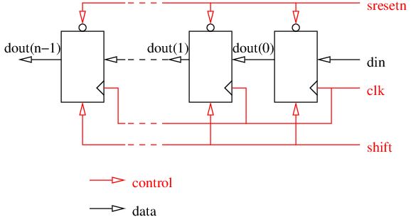

<!--
MASTER-ONLY: DO NOT MODIFY THIS FILE

Copyright © Telecom Paris
Copyright © Renaud Pacalet (renaud.pacalet@telecom-paris.fr)

This file must be used under the terms of the CeCILL. This source
file is licensed as described in the file COPYING, which you should
have received as part of this distribution. The terms are also
available at:
https://cecill.info/licences/Licence_CeCILL_V2.1-en.html
-->

Lab: a shift register

---

[TOC]

---

# Introduction

Information about the importance of the labs' specifications in the automatic evaluation, the solutions, GNU make, the videos, the FAQ, `std_ulogic` vs. `std_logic`.

During this lab we will have a VHDL coding challenge.
The challenge must be completed in a limited amount of time.
Your work is automatically evaluated and scored by the GitLab Continuous Integration System each time you push it.
The scores are informative only.
Use the challenge to check your VHDL understanding and skills.
When instructed to do so:

1. Add-commit-push your branch
1. Fetch, merge with `origin/master`
1. Head your web browser to the lab page
1. Code as fast as you can
1. Compile, simulate with the provided simulation environment
1. Add-commit-push your work
1. Wait for the email
1. If the evaluation failed, click on the **eval** link in the email to see what went wrong, fix what needs to be and add-commit-push your work until all tests pass
1. After the deadline, discuss your solution with your neighbours, ask questions

# Learn a bit more of the VHDL language

- Combinatorial and synchronous processes ([Digital hardware design using VHDL in a nutshell] part of the documentation)
- The `ieee.std_logic_1164` package and the `std_ulogic` type ([The `ieee.std_logic_1164` package] part of the documentation)
- Generic parameters ([Generic parameters] part of the documentation)
- Vector slices and concatenation (section 6.5 of [Free Range Factory] book)
- Aggregate notations ([Aggregate notations] part of the documentation)

# Environment set-up

If you didn't already, first visit the [Notifications] page of the [EURECOM GitLab web site], and for the `pacalet/ds` project, select the `Custom` notification mode.
Check the `Failed pipeline` and ` Successful pipeline` options such that you will receive the results of the evaluations by email each time you push.

As usual, before you can use the compilation and simulation commands, your shell must be configured; if you get `command not found` errors see the [FAQ].

Remember that it is always better to compile and simulate out of the source tree.
Example of set-up if you use GHDL (adapt the suggested `ds` and `sim` paths to your own preferences, replace `ghdl` by `vsim` if you use Modelsim):

```bash
ds=~/Documents/ds"
sim="/tmp/$USER/ds/ghdl"
mkdir -p "$sim"
```

Then, always `cd "$sim"` before simulating and use `"$ds"` to point to the source files (e.g. `"$ds/vhdl/lab02/sr.vhd"`).

# CODING CHALLENGE: a shift register (30 minutes)

Shift registers are a common hardware element that can be found in many designs.
This coding challenge consists in designing a `n`-bits long shift register where `n` is a generic parameter.

## Interface

Edit the file named `sr.vhd`.
Add an entity named `sr` (for Shift Register) with the following generic parameter:

| Name    | Type       | Description                             | Default value |
| :----   | :----      | :----                                   | :----         |
| `n`     | `positive` | size (bit length) of the shift register | 16            |

And the following input-output ports:

| Name      | Type                              | Direction | Description                                                                | 
| :----     | :----                             | :----     | :----                                                                      | 
| `clk`     | `std_ulogic`                      | in        | master clock, the design is synchronized on the **rising** edge of `clk`   | 
| `sresetn` | `std_ulogic`                      | in        | **synchronous**, active **low** reset                                      | 
| `shift`   | `std_ulogic`                      | in        | shift command, the register shifts when `shift` is asserted **high**       | 
| `din`     | `std_ulogic`                      | in        | serial input of the shift register                                         | 
| `dout`    | `std_ulogic_vector(n-1 downto 0)` | out       | current value of the shift register (parallel output)                      | 

## Architecture

In the same VHDL source file add an architecture named `rtl` and code it according the following specifications:

* synchronize your design on the rising edge of `clk`
* use `sresetn` as a **synchronous**, active **low** reset to force `dout` to all zeros
* use one synchronous process only (do not forget the reset)
* on rising edges of `clk`:
   * if `sresetn` is low `dout` is forced to all zeros,
   * else, if `shift='1'`, `dout` is shifted by one position to the left; the bit entering on the right is `din` and the leaving biton the left is lost,
   * else `dout` is unmodified.



## Validation

The provided simulation environment makes use of a random generation package (`rnd_pkg`) from a library named `common` that must be compiled first:


```bash
cd "$sim"
ghdl -a --std=08 --work=common "$ds/vhdl/common/rnd_pkg.vhd"
ghdl -a --std=08 "$ds/vhdl/lab02/sr.vhd" "$ds/vhdl/lab02/sr_sim.vhd"
ghdl -r --std=08 sr_sim --vcd=sr_sim.vcd
```

And use GTKWave to open the `sr_sim.vcd` VCD file. Or:

```bash
cd "$sim"
vcom -2008 +acc -work common "$ds/vhdl/common/rnd_pkg.vhd"
vcom -2008 +acc "$ds/vhdl/lab02/sr.vhd" "$ds/vhdl/lab02/sr_sim.vhd"
vsim -voptargs="+acc" sr_sim
```

Study the code of the simulation environment in `lab02/sr_sim.vhd`, try to understand it, ask questions and take notes.
It can be used as a starting point next time you will want to design a simulation environment.
Have a look also at the code of the `common/rnd_pkg.vhd` random generator package.

## Peer review

After the end of the challenge, compare your solution with your neighbours'.

<!--
# Explore the simulation waveforms in delta mode

Remember that simulation "_deltas_" of the event-driven simulation algorithm are symbolic. They are just a virtual delay between execution phases and signal update phases of the simulation algorithm. They have no physical duration. So, in standard mode, the simulation waveforms do not show them and signal events are apparently simultaneous, even if they are separated by one or more deltas. Modelsim waveform viewer has a mode to visualize the deltas (but remember that deltas have no real physical duration).

If you have Modelsim simulate again your shift register and while the waveform window is active click on the `Wave` menu and select:

```escape
<!Expanded Time / Deltas Mode
Expanded Time / Expand all!>
```

Zoom (enough) on some apparently simultaneous transitions to see the deltas and try to understand what you see.
-->

[Digital hardware design using VHDL in a nutshell]: ../../doc/data/digital-hardware-design-using-vhdl-in-a-nutshell.md
[The `ieee.std_logic_1164` package]:../../doc/data/std_logic_1164.md
[Free Range Factory]: ../../doc/data/free_range_vhdl.pdf
[Generic parameters]: ../../doc/data/generics.md
[Aggregate notations]: ../../doc/data/aggregate-notations.md
[Arithmetic: which types to use?]: ../../doc/data/arithmetic-which-types-to-use.md
[Notifications]: https://gitlab.eurecom.fr/-/profile/notifications
[EURECOM GitLab web site]: https://gitlab.eurecom.fr/
[FAQ]: ../../FAQ.md

<!-- vim: set tabstop=4 softtabstop=4 shiftwidth=4 expandtab textwidth=0: -->
