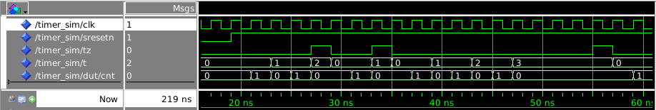
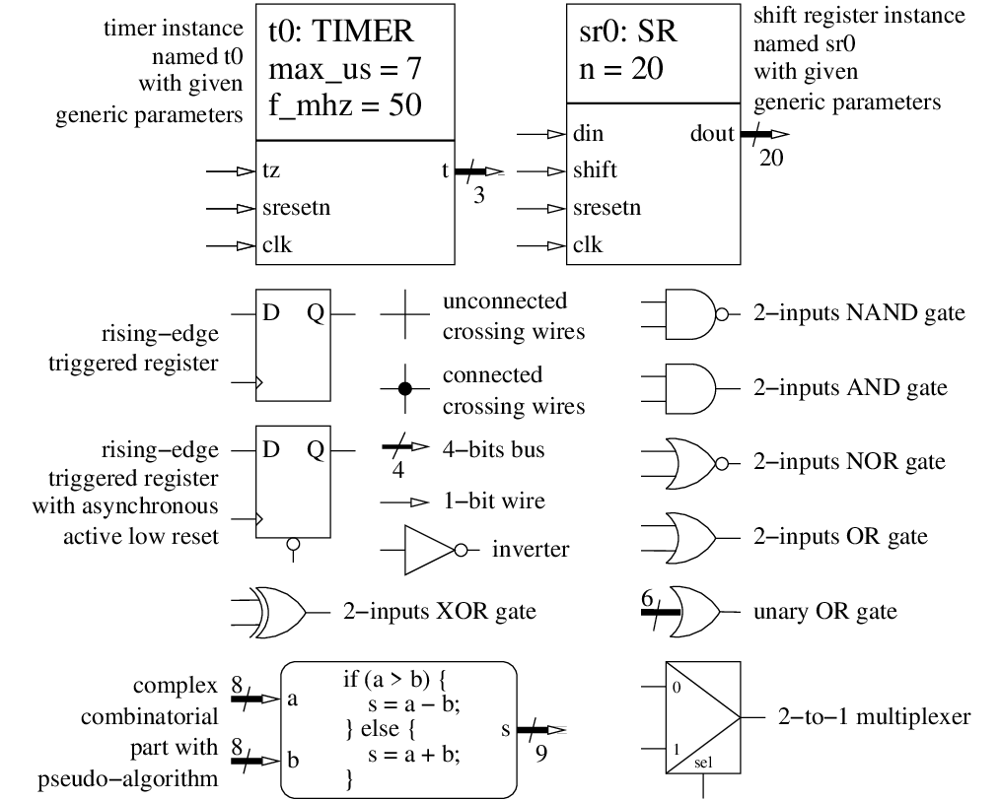

<!--
MASTER-ONLY: DO NOT MODIFY THIS FILE

Copyright © Telecom Paris
Copyright © Renaud Pacalet (renaud.pacalet@telecom-paris.fr)

This file must be used under the terms of the CeCILL. This source
file is licensed as described in the file COPYING, which you should
have received as part of this distribution. The terms are also
available at:
https://cecill.info/licences/Licence_CeCILL_V2.1-en.html
-->

Lab: a timer

---

[TOC]

---

# Learn a bit more of the VHDL language

- Integer types (section 10.8 of [Free Range Factory] book)
- Arithmetic types ([Arithmetic: which types to use?] part of the documentation)

# CODING CHALLENGE: a timer (30 minutes)

Measuring time is sometimes useful.
In this coding challenge we will design a two-stages synchronous timer.
The first stage will run at full clock speed and produce a tick every micro-second.
The second one will count at the tick rate and thus count micro-seconds.

## Specifications

The entity of the timer is named `timer` and its architecture is named `rtl`[^1].
The timer has the following generic parameters:

| Name     | Type                            | Description                                                         | Default value |
| :----    | :----                           | :----                                                               | :----         |
| `f_mhz`  | `positive range 1 to 1000`      | master clock frequency in MHz (also clock periods per micro-second) | 100           |
| `max_us` | `natural`                       | maximum value of timer in micro-seconds                             | 10            |

And the following input-output ports:

| Name       | Type                            | Direction | Description                                                             |
| :----      | :----                           | :----     | :----                                                                   |
| `clk`      | `std_ulogic`                    | in        | master clock, the design is synchronized on the rising edge of `clk`    |
| `sresetn`  | `std_ulogic`                    | in        | **synchronous**, active **low** reset                                   |
| `tz`       | `std_ulogic`                    | in        | force timer to zero                                                     |
| `t`        | `natural range 0 to max_us`     | out       | current value of timer (micro-seconds)                                  |

* The design is synchronized on the rising edge of `clk`.
* `sresetn` is a **synchronous**, active **low** reset that forces the two counters to 0.
* The value of the first stage counter is stored in an internal register `cnt`; on rising edges of `clk`, `cnt` is:
   * forced to 0 if `tz` is high,
   * else unmodified if `t=max_us`,
   * else forced to zero if `cnt=f_mhz-1`,
   * else incremented by one.
* On rising edges of `clk`, `t` is:
   * forced to 0 if `tz` is high,
   * else unmodified if `t=max_us`,
   * else incremented by one if `cnt=f_mhz-1`,
   * else unmodified.

The figure below represents the `clk`, `sresetn`, `tz` and `t` signals, plus the internal `cnt` signal, for `f_mhz=2` and `max_us=3`.

## Schematic

Before coding the VHDL model we will draw a schematic of the digital hardware, according the above specifications.
Start coding only once it is done and convincing.
Even if you think it is a waste of time, try to do it.
Represent registers with rectangular boxes, logic gates with their symbols, more complex combinatorial parts with rounded boxes and a descriptive text.
Connect the elements with arrows or, if the schematic would become too hairy, by named connections (we consider that two lines with the same label are connected).
If it makes sense indicate the width of buses.
Examples of symbols:

## VHDL coding

Edit the file named `timer.vhd`.
Code the `timer` entity and the `rtl` architecture.
Stick to your schematic, just translate it into VHDL.

## Validation

As for the previous lab, the provided simulation environment makes use of the `common.rnd_pkg` random generation package, source file `"$ds/vhdl/common/rnd_pkg.vhd"` that must be compiled first in library `common`.
Compile, simulate and debug your timer.
As you did for `sr_sim.vhd`, have a look at the code of `timer_sim.vhd`.

## Peer review

After the end of the challenge, compare your solution with your neighbours'.

[^1]: RTL is a legacy term for _Register Transfer Level_.
It designates a modelling style that focuses on describing the registers and the exchanges between them.
Other examples of modelling styles are _behavioural_, that is, describing the behaviour with no or few hardware details, or _dataflow_, where the flow of data through the various operators is the main concern.
Behavioural models are not necessarily synthesizable.

[Digital hardware design using VHDL in a nutshell]: ../../doc/data/digital-hardware-design-using-vhdl-in-a-nutshell.md
[The `ieee.std_logic_1164` package]: ../../doc/data/std_logic_1164.md
[Free Range Factory]: ../../doc/data/free_range_vhdl.pdf
[Generic parameters]: ../../doc/data/generics.md
[Aggregate notations]: ../../doc/data/aggregate-notations.md
[Arithmetic: which types to use?]: ../../doc/data/arithmetic-which-types-to-use.md
[Notifications]: https://gitlab.eurecom.fr/-/profile/notifications
[EURECOM GitLab web site]: https://gitlab.eurecom.fr/
[FAQ]: ../../FAQ.md

<!-- vim: set tabstop=4 softtabstop=4 shiftwidth=4 expandtab textwidth=0: -->
