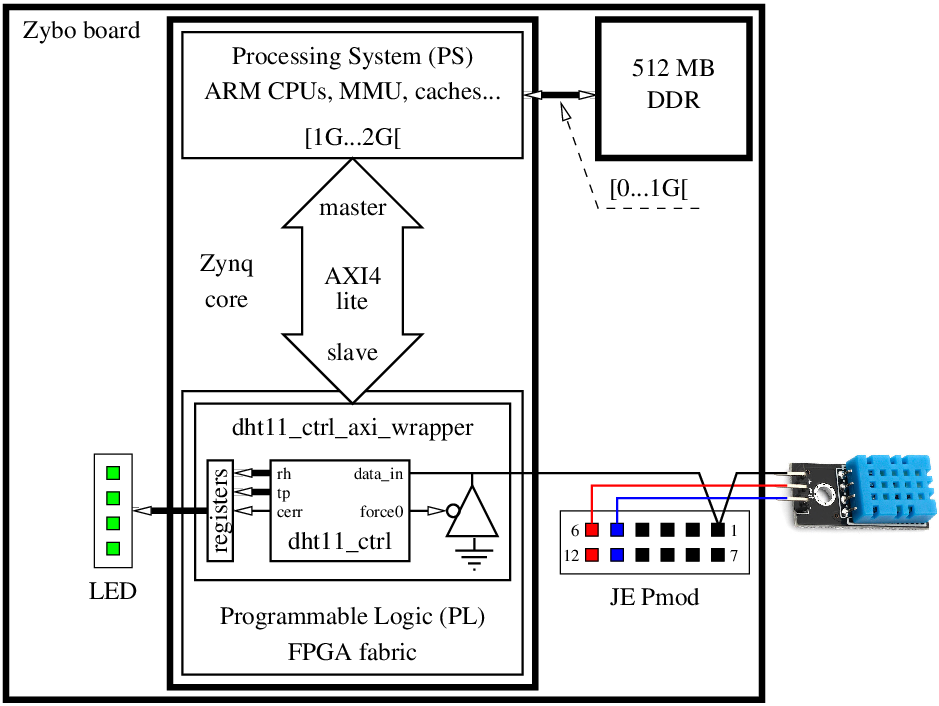
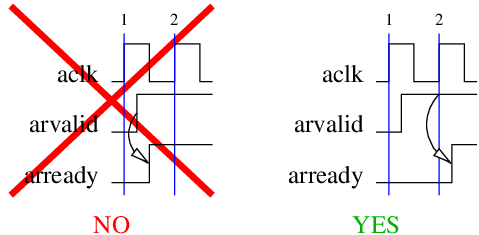

<!--
MASTER-ONLY: DO NOT MODIFY THIS FILE

Copyright © Telecom Paris
Copyright © Renaud Pacalet (renaud.pacalet@telecom-paris.fr)

This file must be used under the terms of the CeCILL. This source
file is licensed as described in the file COPYING, which you should
have received as part of this distribution. The terms are also
available at:
https://cecill.info/licences/Licence_CeCILL_V2.1-en.html
-->

Lab: a AXI4 lite wrapper for the DHT11 controller

---

[TOC]

---

Before working on this lab you must complete the [DHT11 controller](../lab08).

# Learn a bit more of the VHDL language

High impedance, tri-state buffers, multiple drive and resolved VHDL types (discussion, [`std_logic_1164`] and [Resolution functions, unresolved and resolved types] part of the documentation).

# The AXI4 protocol (discussion)

Study the [AXI4 lite protocol]:

- Introduction of section A1.3 "_AXI Architecture_", page A1-22.
- Section A3.1 "_Clock and reset_", page A3-36.
- Section A3.2 "_Basic read and write transactions_", pages A3-37 to A3-39.
- Section A3.3 "_Relationships between the channels_", pages A3-40 to A3-42.
- Section A3.4.4 "_Read and write response structure_", pages A3-54 to A3-55.
- Section B1.1 "_Definition of AXI4-Lite_", pages B1-122 to B1-123.

# A AXI4 lite wrapper for the DHT11 controller

## Introduction

In the Zynq core of the Zybo board the interfaces between the Processing System (PS - the ARM CPU and its peripherals) and the Programmable Logic (PL - the FPGA part) comply with the [AXI4 lite protocol].
In this lab we use one of these interfaces to connect the ARM CPU to our DHT11 controller such that sensed data can be read from the software stack that runs on the CPU.
To do so we design an AXI4 compliant wrapper around the [DHT11 controller](../lab08/).
After synthesis we will map our design on the FPGA matrix of the Zynq core.
Then, we will interact with the GNU/Linux OS running on the ARM CPU and read the sensed data with regular load operations at the physical addresses of the interface registers of our hardware peripheral.

  
*Figure 1: Global system view*

The AXI4 interface we are using is mapped by construction of the Zynq core to the `[0x4000_0000..0x8000_0000[` (`[1GB..2GB[`) address range of the CPU, that is 1GB.
Each time the CPU executes a load or a store instruction at a physical address that falls in this range, the corresponding read or write request is routed to this AXI4 interface and our wrapper receives it.
Our wrapper must acknowledge the request, send a response and maintain its response until the CPU acknowledges the response.

The AXI4 protocol is a very rich protocol that supports out-of-order responses, transaction IDs, bursts, atomic transactions, cache management, quality of service...
But we do not need most of these advanced features, so we restrict it to the simplest possible variant that suits our needs: the AXI4 _lite_ variant, dedicated to the communication with simple peripherals.

The data buses of the AXI4 interface are 32 bits wide (the ARM CPU is a 32 bits CPU).
The width of the address buses could be up to 30 bits (to address one GB of address space).
Our wrapper stores only 17 bits of data (humidity and temperature on 8 bits each, plus a one bit valid flag), that we will pad with zeros up to 32 bits.
So, the address space of our wrapper could be only 4 bytes and the address bus could be only 2 bits wide.
The minimum supported by the Xilinx tools being 12 bits, we will use a 12 bits address bus, but most of the corresponding 4kB address space will be unmapped.
On the CPU point of view, the DHT11 controller is thus mapped in the `[0x4000_0000..0x4000_1000[` address range but not all of these addresses can be used.

> Note: in fact, our DHT11 controller is mapped in any 4kB aligned address sub-range of the `[1GB..2GB[` range.
The CPU could access it, for instance, in the `[0x4567_0000..0x4567_1000[` range instead of `[0x4000_0000..0x4000_1000[`.

In the following we consider only the offset from the `0x4000_0000` base address, that is `[0x000.. 0xfff]` (12 bits addresses, 4kB).
It is the point of view of our peripheral that sees only the 12 least significant bits of the addresses issued by the CPU.

## Interface

The entity is named `dht11_ctrl_axi_wrapper` and its architecture is named `rtl`.
Generic parameters:

| Name       | Type          | Description                                                                        | Default value |
| :----      | :----         | :----                                                                              | :---          |
| `f_mhz`    | `positive`    | master clock frequency in MHz (also clock periods per micro-second)                | 100           |
| `start_us` | `positive`    | duration of `start` command in micro-seconds                                       | 18000         |
| `warm_us`  | `positive`    | duration of warm-up delay (reset-to-first-acquisition, pause between acquisitions) | 1000000       |

Input-output ports:

| Name             | Type                             | Direction | Description                                                                                                            |
| :----            | :----                            | :----     | :----                                                                                                                  |
| `aclk`           | `std_ulogic`                     | in        | master clock from CPU part of Zynq core, the design is synchronized on the rising edge of `aclk`                       |
| `aresetn`        | `std_ulogic`                     | in        | **synchronous** active **low** reset from CPU part of Zynq core (the leading _a_ means AXI, not asynchronous)          |
| `s0_axi_araddr`  | `std_ulogic_vector(11 downto 0)` | in        | read address from CPU (12 bits = 4kB)                                                                                  |
| `s0_axi_arvalid` | `std_ulogic`                     | in        | read address valid from CPU                                                                                            |
| `s0_axi_arready` | `std_ulogic`                     | out       | read address acknowledge to CPU                                                                                        |
| `s0_axi_awaddr`  | `std_ulogic_vector(11 downto 0)` | in        | write address from CPU (12 bits = 4kB)                                                                                 |
| `s0_axi_awvalid` | `std_ulogic`                     | in        | write address valid flag from CPU                                                                                      |
| `s0_axi_awready` | `std_ulogic`                     | out       | write address acknowledge to CPU                                                                                       |
| `s0_axi_wdata`   | `std_ulogic_vector(31 downto 0)` | in        | write data from CPU                                                                                                    |
| `s0_axi_wstrb`   | `std_ulogic_vector(3 downto 0)`  | in        | write byte enables from CPU                                                                                            |
| `s0_axi_wvalid`  | `std_ulogic`                     | in        | write data and byte enables valid from CPU                                                                             |
| `s0_axi_wready`  | `std_ulogic`                     | out       | write data and byte enables acknowledge to CPU                                                                         |
| `s0_axi_rdata`   | `std_ulogic_vector(31 downto 0)` | out       | read data response to CPU                                                                                              |
| `s0_axi_rresp`   | `std_ulogic_vector(1 downto 0)`  | out       | read status response (OKAY, EXOKAY, SLVERR or DECERR) to CPU                                                           |
| `s0_axi_rvalid`  | `std_ulogic`                     | out       | read data and status response valid flag to CPU                                                                        |
| `s0_axi_rready`  | `std_ulogic`                     | in        | read response acknowledge from CPU                                                                                     |
| `s0_axi_bresp`   | `std_ulogic_vector(1 downto 0)`  | out       | write status response (OKAY, EXOKAY, SLVERR or DECERR) to CPU                                                          |
| `s0_axi_bvalid`  | `std_ulogic`                     | out       | write status response valid to CPU                                                                                     |
| `s0_axi_bready`  | `std_ulogic`                     | in        | write response acknowledge from CPU                                                                                    |
| `data`           | `std_logic`                      | inout     | data line to/from DHT11 sensor (wired to `JE1`, pin 1 of the `JE` Pmod connector), bidirectional, so **resolved** type |
| `led`            | `std_ulogic_vector(3 downto 0)`  | out       | wired to the four user LEDs                                                                                            |

## Detailed specifications

Please read the following specifications carefully, each aspect is important.
In the following "_to set_" means "_to assign value `'1'`_", "_to be set_" means "_to have value `'1'`_", "_to unset_" means "_to assign value `'0'`_", and "_to be unset_" means "_to have value `'0'`_"; when used about a vector these terms apply to all bits of the vector.

### DHT11 controller, tri-state buffer, registers, LEDs

Our wrapper instantiates our `dht11_ctrl` entity / architecture.
Its `clk` and `sresetn` ports are connected to the `aclk` and `aresetn` ports.

There is also an instance of a tri-state buffer that our wrapper uses to drive the `data` line low.

Three registers named `v_reg`, `rh_reg` and `tp_reg` are used to store, respectively, a valid flag, the 8-bits acquired relative humidity and the 8-bits acquired temperature.
The `v_reg` valid flag is set at the end of the first acquisition **without error** after reset, and is maintained until the next reset. The `rh_reg` and `tp_reg` registers sample the corresponding outputs of `dht11_ctrl` at the end of every acquisition **without error**.

> Note: "*at the end of the every acquisition without error*" means "*on every rising edge of `aclk` where `aresetn` and the `dso` output of `dht11_ctrl` are set and the `cerr` output of `dht11_ctrl` is unset*".

For debugging purpose the `led` output is constantly driven by:

```vhdl
v_reg & '0' & rh_reg(0) & tp_reg(0)
```

### AXI4 lite machinery

The following waveform represents several AXI4 lite read transactions.
The rising edges of the clock where our wrapper notices a read request are indicated by a blue vertical line.
The rising edges of the clock where the CPU acknowledges a read response are indicated by a red vertical line.
The highest possible throughput (two clock cycles per read operation) corresponds to the two last transactions.

  
*Figure 2: AXI4 lite read transactions*

1. We assume that the CPU complies with the AXI4 lite protocol, but we do not make any other hypotheses about its behaviour; in particular:

   * When it is ready to accept a response, the CPU can set `rready` and/or `bready` in advance, before we actually send a response.
   * The CPU can submit read and write requests simultaneously and, if it does, they must be served simultaneously.

1. In the 4kB address range that our peripheral sees, we map only the first 32-bits word (4 bytes, `[0x000..0x003]`) and it is read-only.
1. We ignore the alignment of accesses, that is, we ignore the 2 least significant bits of the address buses.
The CPU receives the same response for accesses at addresses `0x000`, `0x001`, `0x002` or `0x003`.
1. When we receive a read request at address `0x000`, `0x001`, `0x002` or `0x003` we return the `OKAY` response status and the data corresponding to the last acquisition without error:

    ```vhdl
    s0_axi_rresp <= axi_resp_okay; -- OKAY
    s0_axi_rdata <= v_reg & "000000000000000" & rh_reg & tp_reg;
    ```

1. When we receive a read request at other addresses (`[0x004..0xfff]`) we return the `DECERR` (DECode ERRor) response status and the data can be assigned any value because it will be ignored.
1. There is no combinatorial path between the AXI4 inputs and outputs; the sooner we react to CPU actions is after the following rising edge of the clock:

     
   *Figure 3: No combinatorial path between the AXI4 inputs and outputs*

1. All AXI4 lite outputs of our wrapper shall depend only on values stored in internal registers, not on primary inputs (Moore, not Mealy).
1. When we set `rvalid` (to send a read response), we wait until `rready` is set by the CPU (to acknowledge our response) before we acknowledge new read requests.
Example: on Figure 2 we notice a first read request at rising edge 1.
We acknowledge and respond immediately after rising edge 1 but we notice the CPU acknowledge only at rising edge 5, so it is only after rising edge 6 that we can acknowledge and respond the second read request, while we could have noticed it at rising edge 3.
1. We never set `arready` in advance; it is set only after we noticed a read request.
1. Read requests are served as soon as possible: when `arvalid` is set (and no read response is pending) on rising edge number `N` of clock, `arready` is set and the response is submitted immediately.
After rising edge `N+1` `arready` is unset and, if `rready` is also set on the same rising edge, `rvalid` is also unset (as after rising edges 7, 11 and 13 of Figure 2).

Write accesses are handled independently, by a separate machinery.
The specifications are the same as for read accesses, except that:

1. Write accesses to the `[0x000..0x003]` range return a `SLVERR` (SLaVe ERRor) response status because our DHT11 peripheral is read-only.
1. In the AXI4 lite protocol there are two separate requests for address and data.
Our wrapper groups them and we consider that there is a write request only on a rising edge of the clock where `awvalid` **and** `wvalid` are set.
If only one of `awvalid` and `wvalid` is set we wait until the CPU sets the other.

## Block diagram

As usual draw a block diagram with the `dht11_ctrl` instance, the tri-state buffer, the 3 registers, two rectangular blocks representing the 2 Moore state machines of the AXI4 lite machinery (one for read accesses and one for write accesses), and the combinatorial logic that glues them together.

## State diagram

Draw the state diagrams of the two Moore state machines.

## VHDL coding

Edit the file named `dht11_ctrl_axi_wrapper.vhd`.
Declare the use of the `ieee` library and of the `ieee.std_logic_1164` and `ieee.numeric_std_unsigned` packages.

```vhdl
library ieee;
use ieee.std_logic_1164.all;
use ieee.numeric_std_unsigned.all;
```

As we work with the AXI4 protocol also declare the use of the `common` library and of the `common.axi_pkg` package that declares useful constants for the protocol:

```vhdl
library common;
use common.axi_pkg.all;
```

Look at its content (`vhdl/common/axi_pkg.vhd`).

The tri-state buffer component is declared in the `usnisim.vcomponents` package provided by Xilinx.
Declare the use of `unisim` library and of the `unisim.vcomponents` package:

```vhdl
library unisim;
use unisim.vcomponents.all;
```

Then, code the `dht11_ctrl_axi_wrapper` entity.

In the architecture declaration area add declarations of internal signals to connect the various elements together.
Declare also the following 3 internal signals to model the outputs of 3 registers, synchronized on the rising edges of `aclk`, all forced to zero on rising edges of `aclk` where `aresetn` is unset, and write synchronous processes according the specified behaviour:

| Name     | Type                            | Behaviour                                                                                                      |
| :----    | :----                           | :---                                                                                                           |
| `v_reg`  | `std_ulogic`                    | valid flag, set at the end of the first acquisition **without error** after reset, maintained until next reset |
| `rh_reg` | `std_ulogic_vector(7 downto 0)` | samples the `rh` output of `dht11_ctrl` at the end of the every acquisition **without error**                  |
| `tp_reg` | `std_ulogic_vector(7 downto 0)` | samples the `tp` output of `dht11_ctrl` at the end of the every acquisition **without error**                  |

In the architecture body instantiate the `dht11_ctrl` entity.
Instantiate also the tri-state buffer component from Xilinx (declared in the `usnisim.vcomponents` package):

```vhdl
u_tsb : iobuf
generic map (
  drive      => 12,
  iostandard => "lvcmos33",
  slew       => "slow")
port map (
  o  => data_in,
  io => data,
  i  => '0',
  t  => force0
);
```

Add a concurrent signal assignment such that `led(3 downto 0)` is constantly driven by:

```vhdl
v_reg & '0' & rh_reg(0) & tp_reg(0)
```

Add concurrent signal assignments, combinatorial processes and synchronous processes to implement the 3 registers and the slave side of the AXI4 lite protocol.

## Validation

To validate your design you will need to compile all source files, in the right order, in 2 or 3 different VHDL libraries (`common`, `unisim` and `work`).

Example with Modelsim:

```bash
ds=$HOME/some-where/ds
sim=/tmp/$USER/ds/vsim
mkdir -p $sim
cd $sim
vcom -2008 +acc -work unisim $ds/vhdl/unisim/unisim.vhd
vcom -2008 +acc -work common $ds/vhdl/common/axi_pkg.vhd $ds/vhdl/common/rnd_pkg.vhd $ds/vhdl/common/utils_pkg.vhd $ds/vhdl/common/dht11.vhd
vcom -2008 +acc $ds/vhdl/lab02/sr.vhd
vcom -2008 +acc $ds/vhdl/lab03/timer.vhd
vcom -2008 +acc $ds/vhdl/lab05/edge.vhd
vcom -2008 +acc $ds/vhdl/lab06/counter.vhd
vcom -2008 +acc $ds/vhdl/lab08/dht11_ctrl.vhd
vcom -2008 +acc $ds/vhdl/lab09/dht11_ctrl_axi_wrapper.vhd $ds/vhdl/lab09/dht11_ctrl_axi_wrapper_sim.vhd
vsim -voptargs="+acc" dht11_ctrl_axi_wrapper_sim
```

Or, with the provided `Makefile`:

```bash
cd $HOME/some-where/ds
make dht11_ctrl_axi_wrapper_sim.sim SIM=vsim GUI=yes
```

## Peer review

Compare your solution with your neighbours'.

## Synthesis

We will now synthesize our design with the Vivado tool by Xilinx to map it in the programmable logic part of the Zynq core of the Zybo. **Important**: the version of the tool **must** be 2018.3 (you can check this with `vivado -version`).

The `dht11_ctrl_axi_wrapper.syn.tcl` and `dht11_ctrl_axi_wrapper.params.tcl` TCL scripts will automate the synthesis and the `boot.bif` file will tell the Xilinx tools what to do with the synthesis result.
As usual, before you can use the synthesis scripts, you will have to edit `dht11_ctrl_axi_wrapper.params.tcl` and add information about the primary inputs and outputs (I/O) in the definition of the `ios` array.
Specify also the start delay and the warm-up delay with the `start_us` and `warm_us` variables, respectively.
The clock frequency is already set to 100 MHz with variable `f_mhz` this is the frequency of the clock that the CPU part will generate and send to the FPGA part.

> Note: we could try to run the FPGA part at a higher clock frequency but as our design is not oriented toward high performance it would be useless.

Cross-check your edits with your neighbours.

Observe the part of the `dht11_ctrl_axi_wrapper.syn.tcl` synthesis script entitled "_Addresses ranges_".
It defines the base address of the peripheral in the system address map (property `offset`) and its address range (property `range`).
Remember these two values.

If everything looks fine, synthesize:

```bash
ds=$HOME/some-where/ds
syn=/tmp/$USER/ds/syn
mkdir -p $syn
cd $syn
vivado -mode batch -source $ds/vhdl/lab09/dht11_ctrl_axi_wrapper.syn.tcl -notrace
```

All log messages are printed on the standard output and stored in the `vivado.log` log file.
Check for errors and warnings in the log file.

A flat resource utilization report is available in `dht11_ctrl_axi_wrapper.utilization.rpt`.
Open it and look at the first table of the `Slice Logic` section.
Check that you do not have any unwanted "_Register as Latch_".

A hierarchical resource utilization report is available in `dht11_ctrl_axi_wrapper.utilization.hierarchical.rpt`.
Check that you have the expected number of "_Register as Flip Flop_" (registers used as Flip Flop) in each of your own designs under `dht11_ctrl_axi_wrapper`.
Check also that the other resources ("_LUT as Logic_", "_LUT as Memory_", "_Block RAMs_", "_DSPs_"...) are about in line with the complexity of your design.

A timing report is available in `dht11_ctrl_axi_wrapper.timing.rpt`.
Open it and check that you do not have critical warnings or errors in the first sections.
Then, check that "_All user specified timing constraints are met_".
Look also at the first of the "_Max Delay Paths_" and try to understand where it starts from, where it ends and how long it is.

The main synthesis result is in `dht11_ctrl_axi_wrapper.bit`.
If there were no synthesis errors or serious warnings, if the resource utilization and timing reports look OK, use the `bootgen` utility to pack the bitstream with the first (`fsbl.elf`) and second (`u-boot.elf`) stage software boot loaders that can be found in `/packages/LabSoC/ds-files`:

```bash
cd $syn
cp /packages/LabSoC/ds-files/fsbl.elf .
cp /packages/LabSoC/ds-files/u-boot.elf .
bootgen -w -image $ds/vhdl/lab09/boot.bif -o boot.bin
```

The result is a *boot image*: `boot.bin`.

**IMPORTANT:** in the next lab we will reuse synthesis products of this lab.
Copy them in a safe place, but not in the git repository (Remember? Generated files have nothing to do in a git repository):

```bash
mkdir -p ~/ds_archive
cd $syn
cp boot.bin dht11_ctrl_axi_wrapper.xsa ~/ds_archive
```

## Test

In the following we will use the USB link between our computer and the Zybo board to communicate with the operating system that runs on the ARM CPU of the Zynq core.
For this, if you do not have one already, you need to install a serial communication program on your computer, also frequently referred to as a _terminal emulator_.
Please refer to the [FAQ](../../FAQ.md#terminal-emulators) if you do not know where to start from.

Mount the micro SD card on a computer and define a shell variable that points to it:

```bash
SDCARD=<path-to-mounted-sd-card>
```

If your micro SD card does not yet contain the software components of the DigitalSystems reference design, prepare it:

```bash
cd /packages/LabSoC/ds-files
cp uImage devicetree.dtb uramdisk.image.gz $SDCARD
```

Copy the new boot image to the micro SD card:

```bash
cp $syn/boot.bin $SDCARD
sync
```

Unmount the micro SD card, eject it, plug it on the Zybo but do not power up now.

Open the small plastic box that contains the DHT11 module and inspect it.
The DHT11 sensor (the blue box) is connected to a small electronic board with two connectors (we will only use the 3 pins black connector located on the bottom side) and a 10 k-Ohms pull-up resistor.
If you carefully inspect the top side of the module you should see two metal tracks, one for the data line (labelled _S_) and the other for the power supply (_V_).
They connect the sensor to the two connectors.
There is no visible metal track for the ground (_G_) because it is routed in an inner layer of the printed circuit board.
A tiny rectangular Surface Mounted Device (SMD) component is soldered between the data line and the power supply.
It is the pull-up resistor.
With powerful enough magnifying glasses you could see the `103` label on it, where `10` is the significant value and `3` the power-of-ten of the multiplier, which means $`\mathbf{10}\times10^\mathbf{3}\ \Omega`$.

Imagine how you will connect the DHT11 sensor to the `JE` PMOD connector (you will need the male-female wire).
The figure below and also figure 16, page 24/26 of the [Zybo reference manual] should help you.
Cross-check with your neighbours and connect the module to the Zybo.


*Figure 4: The DHT11 sensor connected to the `JE` Pmod connector of the Zybo board*

Power on the Zybo.
Observe the LEDs.
After a few seconds you should see the `v` flag set.

Launch your serial communication program (e.g. `picocom`) and attach it to the serial device that corresponds to the Zybo board (which you will first have to find).
Example under macOS with `picocom` if the device is `/dev/cu.usbserial-210279A42E221`:

```bash
picocom -b115200 /dev/cu.usbserial-210279A42E221
```

```escape
<!...
Welcome to DS (c) Telecom Paris
ds login: root
root@ds>!>
```

Example under GNU/Linux with `picocom` if the device is `/dev/ttyUSB1`:

```bash
picocom -b115200 /dev/ttyUSB1
```

```escape
<!...
Welcome to DS (c) Telecom Paris
ds login: root
root@ds>!>
```

You are now connected as the `root` user under the GNU/Linux OS that runs on the Zynq core of the Zybo board.
The default shell is `bash`.
Use the `devmem` utility to read the registers:

```bash
root@ds> devmem -h
```

```escape
<!BusyBox v1.29.3 (2019-02-22 10:03:35 CET) multi-call binary.

Usage: devmem ADDRESS [WIDTH [VALUE]]

Read/write from physical address

 -| ADDRESS    Address to act upon
 -| WIDTH    Width (8/16/...)
 -| VALUE    Data to be written
root@ds> devmem 0x40000000 32
0x80003719!>
```

> Note: the `devmem` utility allows to access any memory region by its physical address.
For obvious reasons this is a major security hole.
In most systems it is usable only by the `root` super-user or not even available at all.
Moreover, it is not very convenient.
If you are comfortable enough with the `bash` shell or with `python` you could write a small script that uses `devmem` to print the sensed data in a bit more user-friendly way, add it to the SD card and boot the Zybo.
The SD card is mounted by default in `/media/sdcard`.
Use your script instead of `devmem`:

   ```bash
   root@ds> /media/sdcard/my_nice_script.sh
   ```

   ```escape
   <!Last correct acquisition:
     Temperature:       22°C
     Relative humidity: 44%!>
   ```

   In the next lab we will design a Linux device driver (a _kernel module_ in Linux parlance) for our DHT11 controller.
This will solve the two mentioned issues with `devmem`.

Try to read and write with `devmem` at various addresses to check that your implementation of the AXI4 lite protocol complies with the standard and with the specifications.
When you are done with your experiments, cleanly shut down the Zybo (do not forget to unmount the SD card if you mounted it):

```bash
root@ds> umount /media/sdcard
root@ds> poweroff
```

```escape
<!...
Requesting system poweroff
reboot: System halted!>
```

You can now safely power off the board.

[Zybo reference manual]: ../../doc/data/zybo_rm.pdf
[Resolution functions, unresolved and resolved types]: ../../doc/data/resolution-functions-unresolved-and-resolved-types.md
[`std_logic_1164`]: ../../doc/data/std_logic_1164.md
[AXI4 lite protocol]: ../../doc/data/axi.pdf

<!-- vim: set tabstop=4 softtabstop=4 shiftwidth=4 expandtab textwidth=0: -->
