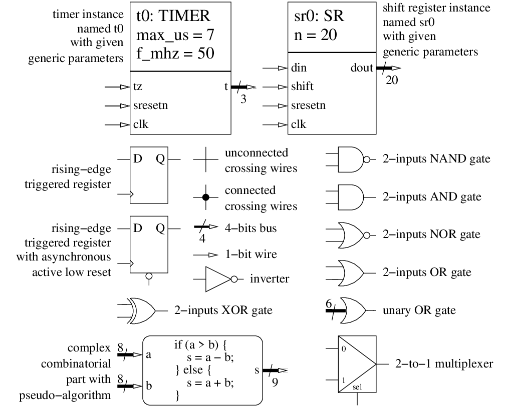

<!--
MASTER-ONLY: DO NOT MODIFY THIS FILE

Copyright © Telecom Paris
Copyright © Renaud Pacalet (renaud.pacalet@telecom-paris.fr)

This file must be used under the terms of the CeCILL. This source
file is licensed as described in the file COPYING, which you should
have received as part of this distribution. The terms are also
available at:
https://cecill.info/licences/Licence_CeCILL_V2.1-en.html
-->

Lab: a LED blinker

---

[TOC]

---

# Learn a bit more of digital hardware design

- Re-synchronizers (discussion).
- De-bouncers (discussion).

# Learn a bit more of the VHDL language

- Entity instantiations ([Entity instantiations] part of the documentation).
- Conditional concurrent signal assignments (section 4.4 of [Free Range Factory] book).
- Aliases.
- Unary boolean operators.

# CODING CHALLENGE: a LED blinker (45 minutes)

In this challenge we will assemble our shift register and our timer, plus custom processes, to create a LED blinker.

## Specifications

The entity of the LED blinker is named `lb` and its architecture is named `rtl`.
The LED blinker has the following generic parameters:

| Name       | Type                            | Description                                                         | Default value |
| :----      | :----                           | :----                                                               | :----         |
| `f_mhz`    | `positive range 1 to 1000`      | master clock frequency in MHz (also clock periods per micro-second) | 100           |
| `delay_us` | `positive range 1 to 1000000`   | number of micro-seconds between two LED blinks                      | 10            |

And the following input-output ports:

| Name       | Type                            | Direction | Description                                                              |
| :----      | :----                           | :----     | :----                                                                    |
| `clk`      | `std_ulogic`                    | in        | master clock, the design is synchronized on the rising edge of `clk`     |
| `areset`   | `std_ulogic`                    | in        | **asynchronous**, active **high** reset, wired to right user push-button |
| `led`      | `std_ulogic_vector(3 downto 0)` | out       | wired to the 4 user LEDs                                                 |

* The design is synchronized on the rising edge of `clk`.
* There is a 2-bits [shift register](../lab02/) used to resynchronize an inverted version of `areset`, named `sresetn`.
* `sresetn` is used as a **synchronous**, active **low** reset for all synchronous parts, except the 2-bits shift register used as re-synchronizer, of course.
* There is a [timer](../lab03/) with `f_mhz` clock frequency and `delay_us` maximum value.
* The timer is forced to zero when it reaches `delay_us`.
* There is a 4-bits [shift register](../lab02/) which parallel output is `led`.
* The 4-bits shift register shifts when the timer reaches `delay_us`.
* When the 4-bits shift register shifts for the first time after reset, a `'1'` enters at the serial input; afterwards the shift register is a closed loop: the leftmost output bit is connected to the serial input; this way it becomes a rotating 4-bits register with only one bit set.

## Schematic

As for the [previous lab](../lab03/), before coding the VHDL model, draw a schematic of the digital hardware according the above specifications.
Represent registers with rectangular boxes, entity instances with named rectangular boxes, logic gates with their symbols, more complex combinatorial parts with rounded boxes and a descriptive text.
Connect the elements with arrows or, if the schematic would become too hairy, by named connections (we consider that two lines with the same label are connected).
If it makes sense indicate the width of buses.
Examples of symbols:



## VHDL coding

Edit the file named `lb.vhd` (for Led Blinking).
Code the `lb` entity and the `rtl` architecture.
Stick to your schematic, just translate it into VHDL.

## Validation

Validate your design using the provided simulation environment:

```bash
cd $sim
ghdl -a --std=08 $ds/vhdl/lab02/sr.vhd $ds/vhdl/lab03/timer.vhd $ds/vhdl/lab04/lb.vhd $ds/vhdl/lab04/lb_sim.vhd
ghdl -r --std=08 lb_sim --vcd=lb_sim.vcd
gtkwave lb_sim.vcd
```

Or:

```bash
cd $sim
vcom -2008 +acc $ds/vhdl/lab02/sr.vhd $ds/vhdl/lab03/timer.vhd $ds/vhdl/lab04/lb.vhd $ds/vhdl/lab04/lb_sim.vhd
vsim -voptargs="+acc" lb_sim
```

## Peer review

After the end of the challenge, compare your solution with your neighbours'.

## Logic synthesis and test on the Zybo

We will now synthesize our design with the Vivado tool by Xilinx to map it in the programmable logic part of the Zynq core of the Zybo.
The clock (`clk`) will come from the on-board Ethernet chip depicted on Figure 13, page 21/26, of the [Zybo reference manual].
The `areset` asynchronous reset will come from the rightmost user press-button (`BTN0`) of the Zybo board.
The `led` output, of course, will be sent to the 4 user LEDs of the Zybo board.

The `lb.syn.tcl` and `lb.params.tcl` TCL scripts will automate the synthesis and the `boot.bif` file will tell the Xilinx tools what to do with the synthesis result.
Before you can use the synthesis scripts, you will have to edit `lb.params.tcl` and add information about the primary inputs and outputs (I/O), as we did for the [first lab](../lab01/).
Let us deal with the `clk` case, as an example:

* We want to connect this primary input of our design to the output clock of the on-board Ethernet chip.
In the [Zybo reference manual], look at Figure 13, page 21/26.
You should see that the output clock of the on-board Ethernet chip is routed to the `L16` pin of the Zynq core.
Note also the frequency of this clock: 125 MHz.
* Page 10/13 of the [Zybo schematics], we see two groups (banks) of I/O pins of the Zynq core represented as yellow boxes.
The `L16` pin belongs to bank 35.
Above the top-left corner of each I/O bank we can see its operation voltage.
For bank 35 it is `VCC3V3`, for 3.3 volts.
The voltage level to use is thus 3.3 volts and the fully qualified voltage class is `LVCMOS33` (if the voltage level was 2.5 volts it would be `LVCMOS25`).

Add these information (pin, voltage class and voltage level) in your personal copy of the `lb.params.tcl` synthesis script:

```tcl
array set ios {
  clk    { L16 LVCMOS33 }
  ...
}
```

Do the same for the other inputs and outputs.
Remember that they will all use the `LVCMOS` voltage class.

In the same `lb.params.tcl` synthesis script also specify the frequency of our clock with the `f_mhz` variable:

```tcl
set f_mhz 125
```

Finally, chose a delay in micro-seconds between two LED blinks and specify it with the `delay_us` variable (consider that if it is too large the show will not be very exciting, while if it is too small, it will probably be too fast for your eyes):

```tcl
set delay_us <some-reasonable-value>
```

Cross-check your findings with your neighbours.
If everything looks fine, synthesize:

```bash
ds=/homes/$USER/ds
syn=/tmp/$USER/ds/syn
mkdir -p "$syn"
cd "$syn"
vivado -mode batch -source "$ds/vhdl/lab04/lb.syn.tcl" -notrace
```

All log messages are printed on the standard output and stored in the `vivado.log` log file.
If there are errors during the synthesis of your design it is this `vivado.log` file that probably contains the most valuable error messages.

A resource utilization report is available in `lb.utilization.rpt`.
Open it and look at the first table of the `Slice Logic` section.
Check that you have the expected number of "_Register as Flip Flop_" (registers used as Flip Flop) and that you do not have any unwanted "_Register as Latch_".
Check also that the other resources ("_LUT as Logic_", "_LUT as Memory_", "_Block RAMs_", "_DSPs_"...) are about in line with the complexity of your design.

A timing report is available in `lb.timing.rpt`.
Open it and check that you do not have critical warnings or errors in the first sections.
Then, check that "_All user specified timing constraints are met_".
Look also at the first of the "_Max Delay Paths_" and try to understand where it starts from, where it ends and how long it is.

The main synthesis result is in `lb.bit`.
It is a binary file called a *bitstream* that is used by the Zynq core to configure the programmable logic.

If there were no synthesis errors or serious warnings, if the resource utilization and timing reports look OK, we must now use the `bootgen` utility to pack the bitstream with the first (`fsbl.elf`) and second (`u-boot.elf`) stage software boot loaders that we already used with the continuity tester and that can be found in `/packages/LabSoC/ds-files`:

```bash
cd "$syn"
cp /packages/LabSoC/ds-files/fsbl.elf .
cp /packages/LabSoC/ds-files/u-boot.elf .
bootgen -w -image "$ds/vhdl/lab04/boot.bif" -o boot.bin 
```

The result is a *boot image*: `boot.bin`.
Mount the micro SD card on a computer and define a shell variable that points to it:

```bash
SDCARD=<path-to-mounted-sd-card>
```

If your micro SD card does not yet contain the software components of the DigitalSystems reference design, prepare it:

```bash
cd /packages/LabSoC/ds-files
cp uImage devicetree.dtb uramdisk.image.gz "$SDCARD"
```

Copy the new boot image to the micro SD card:

```bash
cp "$syn/boot.bin" "$SDCARD"
sync
```

Unmount the micro SD card, eject it, plug it on the Zybo, power on the Zybo and test your design.

[Entity instantiations]: ../../doc/data/entity-instantiations.md
[Zybo reference manual]: ../../doc/data/zybo_rm.pdf
[Zybo schematics]: ../../doc/data/zybo_sch.pdf
[Notifications]: https://gitlab.eurecom.fr/-/profile/notifications
[EURECOM GitLab web site]: https://gitlab.eurecom.fr/
[FAQ]: ../../FAQ.md

<!-- vim: set tabstop=4 softtabstop=4 shiftwidth=4 expandtab textwidth=0: -->
